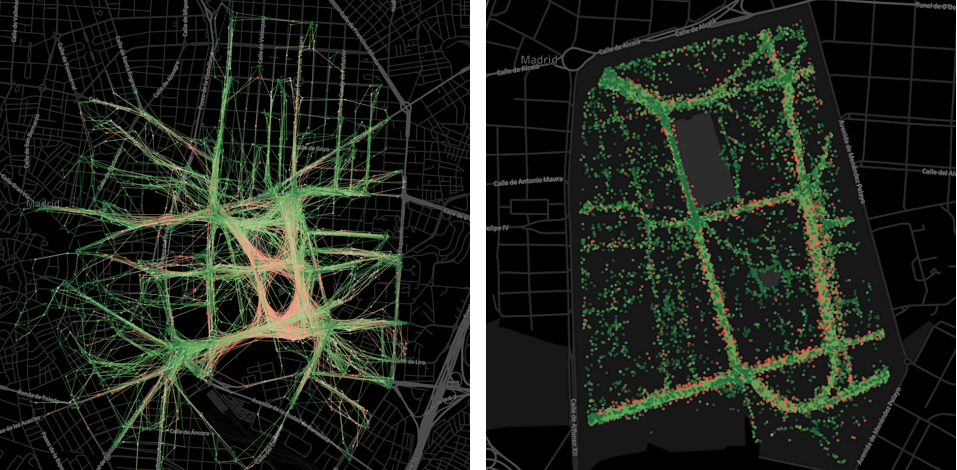

## Análisis del servicio BiciMAD en El Retiro

Este proyecto ha sido desarrollado por Víctor Lavandeira Murat como trabajo final de la VI edición del *Máster en Data Science* de [KSchool](https://kschool.com/) en Madrid.

El propósito es utilizar los [datos de libre acceso](http://opendata.emtmadrid.es/Datos-estaticos/Datos-generales-\(1\)) proporcionados por la EMT de Madrid para estudiar el uso del servicio de bicicletas públicas [BiciMAD](https://www.bicimad.com/) dentro del parque de El Retiro durante el mes de agosto de 2018.

Los principales objetivos son:
- Realizar el filtrado que, en base a criterios geoespaciales, permite identificar los trayectos que han transitado por El Retiro.
- Agrupar los trayectos en función de sus características (*clustering*) para entender el uso que se hace de las bicicletas según la hora y el día de la semana.
- Hacer una predicción sencilla sobre días futuros, que podrá ser más ambiciosa disponiendo de más datos de entrenamiento.
- Presentar de forma visual algunas de las conclusiones que se han obtenido.

Dado su propósito académico, el trabajo se dispone en cuatro *Jupyter notebooks* que combinan código y explicaciones. También se proporciona una historia de *Tableau* en un fichero dedicado.

Para cualquier información relacionada puede contactar con el autor en vicaliege@gmail.com
